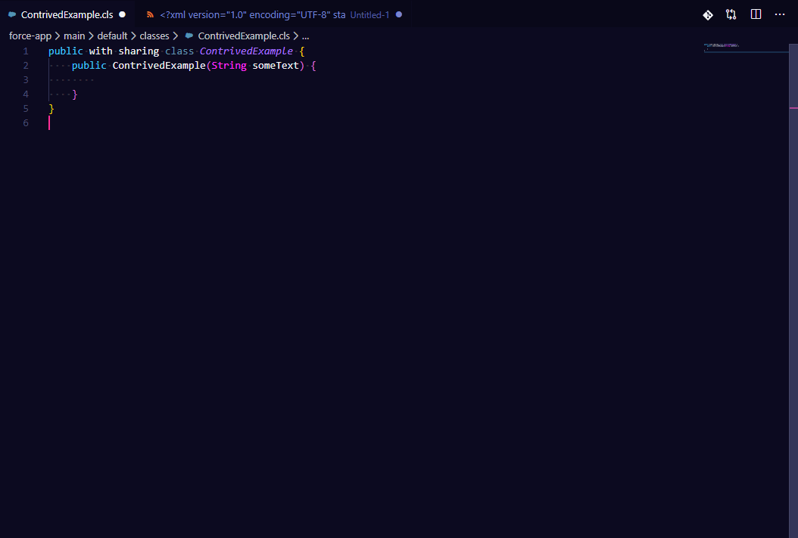
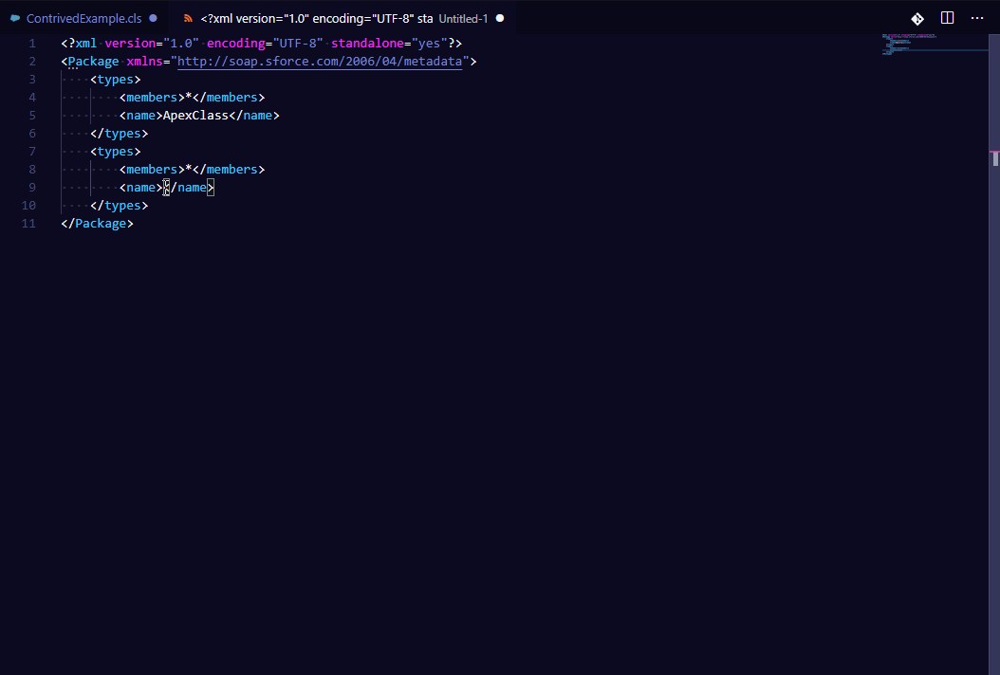
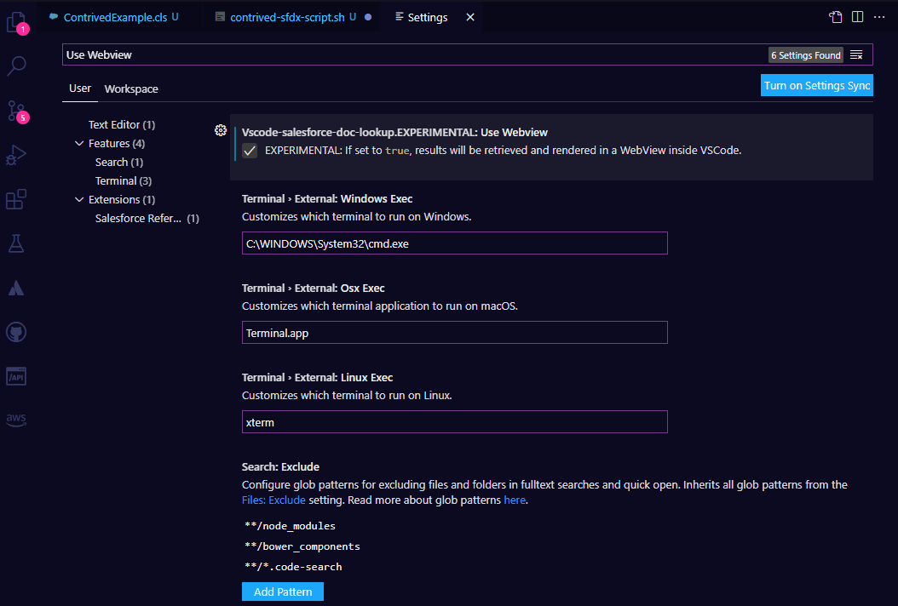

# Salesforce Reference Extension for VSCode

**Search Salesforce Developer Documentation entries in VSCode, and open them in your browser (or with experimental features: in VSCode itself!).**

_**Please Note**: this is a community-made plugin, and is not affiliated with Salesforce. If the extension breaks,
please open a github issue to let me know, there's a chance Salesforce may change its doc approach, necessitating
an update to the plugin_

Repository Home: https://github.com/Oblongmana/vscode-salesforce-doc-lookup

VSCode Marketplace Install: https://marketplace.visualstudio.com/items?itemName=Oblongmana.vscode-salesforce-doc-lookup

A port of my original [plugin for Sublime Text](https://github.com/Oblongmana/sublime-salesforce-reference)

## Table of Contents
- [Current Features](#current-features)
  - [Choose a documentation type, and type in your search](#choose-a-documentation-type-and-type-in-your-search)
  - [Search dev documentation for a word or selection in your editor](#search-dev-documentation-for-a-word-or-selection-in-your-editor)
- [Experimental Features](#experimental-features)
  - [EXPERIMENTAL: Load Documentation in VSCode](#experimental-load-documentation-in-vscode)
- [Installing](#installing)
  - [In VSCode or the Extension Marketplace](#in-vscode-or-the-extension-marketplace)
  - [Manually (with use cases/caveats)](#manually-with-use-casescaveats)
- [Known Issues](#known-issues)
  - [Adblockers and loading links in Browser - NOFIX:](#adblockers-and-loading-links-in-browser---nofix)
- [Notable Differences to the original Sublime Text 3 version](#notable-differences-to-the-original-sublime-text-3-version)
- [Release Notes](#release-notes)
- [Roadmap](#roadmap)
- [Contributing](#contributing)
- [Design Notes](#design-notes)
- [License](#license)
- [Credits](#credits)

## Current Features

### Choose a documentation type, and type in your search
The following new commands allow you to search Salesforce Dev documentation in VSCode, and be taken directly to the corresponding entries in your browser:
 - Salesforce Reference: Apex
 - Salesforce Reference: Visualforce
 - Salesforce Reference: Lightning Console
 - Salesforce Reference: Classic Console
 - Salesforce Reference: Metadata API
 - Salesforce Reference: Object Reference
 - Salesforce Reference: REST API
 - Salesforce Reference: SOAP API
 - Salesforce Reference: SFDX CLI

The first time you call any of these commands, the Extension will call out to Salesforce to get an index of that documentation type. This will be cached, and future uses of the command will be instant.

If you need to invalidate the cache for any reason, there is a command for doing so:
 - Salesforce Reference: Invalidate Cache

### Search dev documentation for a word or selection in your editor
With your cursor over a word in your editor, or with something in your editor selected, you can choose a documentation type and search for that string, using the new command:
 - Salesforce Reference: Search for current word or selection

## Experimental Features

### EXPERIMENTAL: Load Documentation in VSCode
Load documentation directly in VSCode. Enable the "Use WebView" option in your Settings to use this. Please note this is in active development, and is not fully supported. If you encounter bugs, please post an issue on github.

## Installing

### In VSCode or the Extension Marketplace
Search for "Salesforce Reference" in the Extensions view (Ctrl + Shift + X) in VSCode, or install at [our VSCode Extension Marketplace page](https://marketplace.visualstudio.com/items?itemName=oblongmana.vscode-salesforce-doc-lookup)

### Manually (with use cases/caveats)
If you would prefer to install outside of the VSCode Marketplace, I'll try to make `vsix` files available with each release. If I forget, just open an issue on github.

If you're doing this for use in an environment without an internet connection, or a limited connection, please note that this plugin interacts with the web in the following ways:
1. When using any of the documentation commands for the first time after install or running the cache invalidation command, the documentation Table of Contents will be retrieved from developer.salesforce.com
2. When choosing an item from a documentation command, the documentation page will open in your default web browser

If you feel passionately about being able to access doc offline, note there are some ideas in [NOTES.md](NOTES.md) and [ROADMAP.md](ROADMAP.md)

Go to https://github.com/Oblongmana/vscode-salesforce-doc-lookup/releases and download your desired version as a vsix file.

Using the `Install from VSIX` command in the Extensions view command drop-down, or the `Extensions: Install from VSIX` command in the Command Palette, point to the .vsix file.

Alternatively, install it using the following command, and **RESTART VSCode AFTERWARDS**.

    code --install-extension [path to the downloaded vsix]

Alternatively, you can build it yourself, but instructions for that are outside the scope of this README.

## Known Issues

### Adblockers and loading links in Browser - NOFIX:
Because Salesforce's Doc website is an Angular app that dynamically loads content into the page after the page itself has loaded, anchor links
appear to be managed in such a way that the Angular app (rather than the browser) handles the scrolling to the requested item.
e.g. https://developer.salesforce.com/docs/atlas.en-us.apexcode.meta/apexcode/apex_methods_system_string.htm#apex_System_String_substring - the
section after the `#` is the anchor link, trying to take you directly to substring. This Salesforce Angular App functionality may play a little
poorly with some adblockers such as "uBlock Origin". If you find commands are not scrolling you to the item you request, this may be fixed
by disabling your adblocker on the Salesforce doc site, if you are comfortable with doing so.

## Notable Differences to the original Sublime Text 3 version

See [DIFFERENCES.md](DIFFERENCES.md) for information on the differences between this and the original plugin. Also note the [Current Features](#current-features) list above.

## Release Notes
See [CHANGELOG.md](CHANGELOG.md)

## Roadmap
A rough roadmap is available at [ROADMAP.md](ROADMAP.md)

## Contributing

See the Roadmap in [ROADMAP.md](ROADMAP.md) for details on existing aims. Some not-particularly-tidy notes can be found in NOTES.md. Contributions welcome, though I suggest
opening an issue ticket on github to discuss before hand.

## Design Notes
Notes on design, future aims etc available in [NOTES.md](NOTES.md)

## License

Salesforce Reference VSCode Extension

Copyright (c) 2014-2020 James Hill me@jameshill.io

This program is free software: you can redistribute it and/or modify it under the terms of the GNU General Public License as published by the Free Software Foundation, either version 3 of the License, or (at your option) any later version.

This program is distributed in the hope that it will be useful, but WITHOUT ANY WARRANTY; without even the implied warranty of MERCHANTABILITY or FITNESS FOR A PARTICULAR PURPOSE. See the GNU General Public License for more details.

You should have received a copy of the GNU General Public License along with this program. If not, see http://www.gnu.org/licenses/.

## Credits

All Salesforce Documentation is © Copyright 2000–2020 salesforce.com, inc.

Thanks to [Marco Zeuli](https://github.com/maaaaarco) for his contributions in the [original repo](https://github.com/Oblongmana/sublime-salesforce-reference) to making extra types of documentation available in the plugin

Credit to [Luke McFarlane](https://github.com/lukemcfarlane) for the inspiration!